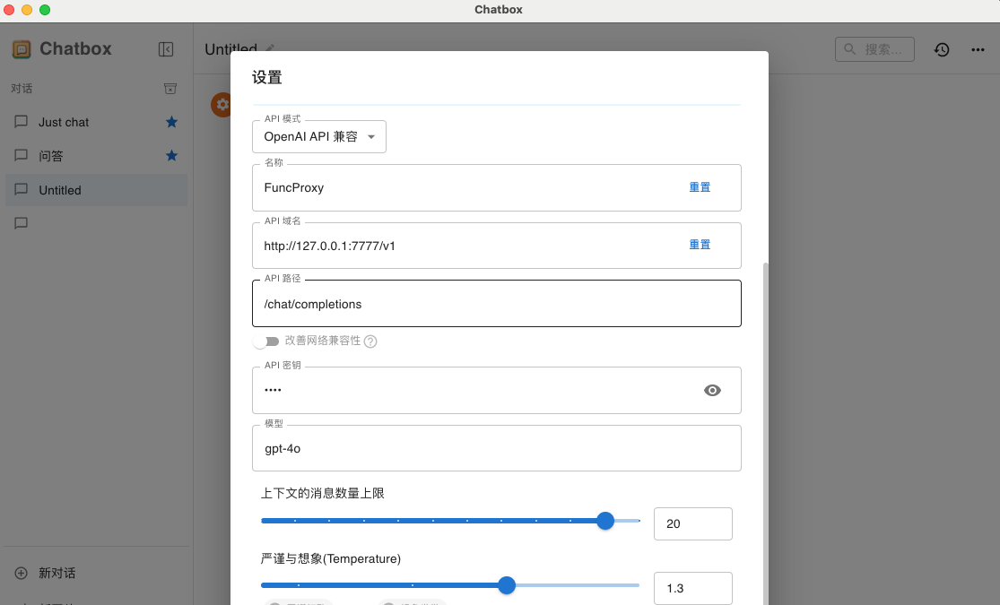

# FuncProxy


## 工作流程图


## 使用说明

1. 运行
```shell
docker build . -t funcproxy:v1
docker run --name funcproxy -it -d -p 7777:7777 funcproxy:v1
```

2. 访问 http://localhost:7777

3. 配置上游API服务、管理扩展


4. 配置客户端

